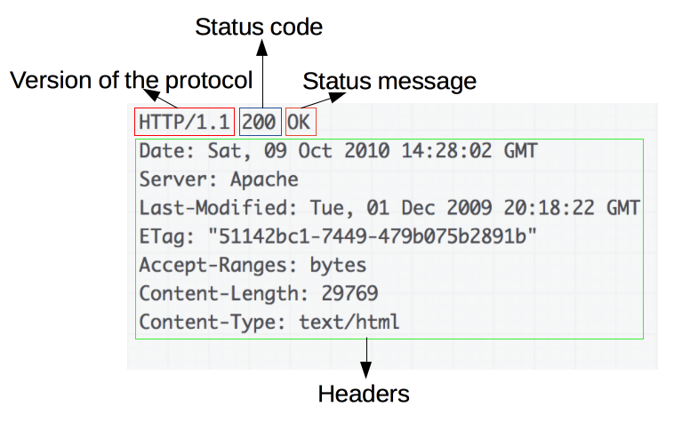

# HTTP

## What is HTTP? 
HTTP is a protocol which allows the fetching of resources, 
such as HTML documents. It is the foundation of any data exchange 
on the Web and it is a client-server protocol, which means requests 
are initiated by the recipient, usually the Web browser. 
A complete document is reconstructed from the different 
sub-documents fetched, for instance text, layout description, 
images, videos, scripts, and more.

### HTTP Messages
HTTP messages, as defined in HTTP/1.1 and earlier, 
are human-readable. In HTTP/2, these messages are embedded into 
a binary structure, a frame, allowing optimizations like 
compression of headers and multiplexing. Even if only part 
of the original HTTP message is sent in this version of HTTP, 
the semantics of each message is unchanged and the client 
reconstitutes (virtually) the original HTTP/1.1 request. 
It is therefore useful to comprehend HTTP/2 messages in the HTTP/1.1 format.

#### Requests

#### Responses

#### Resources
https://developer.mozilla.org/en-US/docs/Web/HTTP/Overview